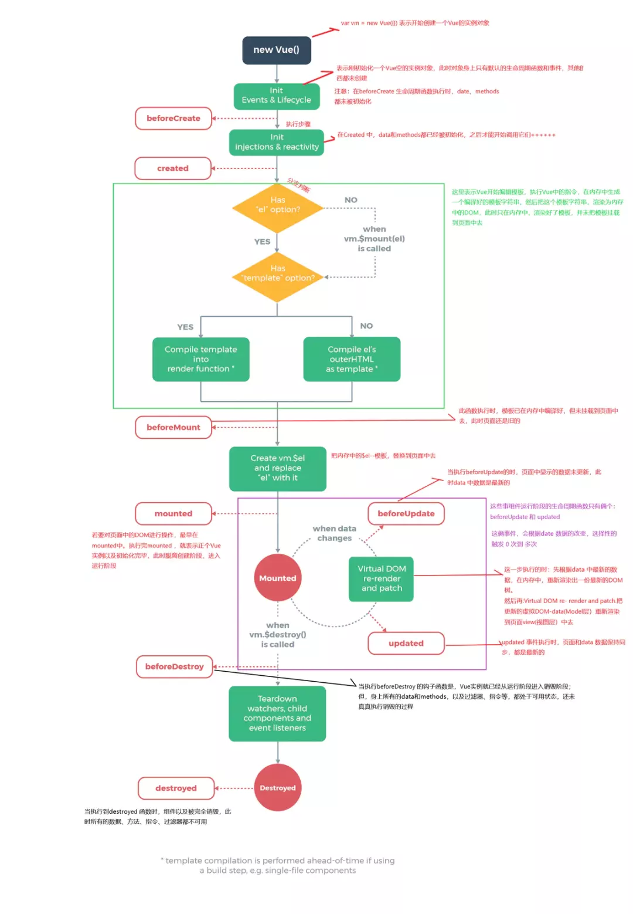

# 生命周期

Vue生命周期总共可以分为8个阶段：创建前后, 载入前后,更新前后,销毁前销毁后，以及一些特殊场景的生命周期。

生命周期 | 描述
:--: | :--:
beforeCreate | 组件实例被创建之初
created | 组件实例已经完全创建
beforeMount | 组件挂载之前
mounted | 组件挂载到实例上去之后
beforeUpdate | 组件数据发生变化，更新之前
updated | 数据数据更新之后
beforeDestroy | 组件实例销毁之前
destroyed | 组件实例销毁之后
activated | keep-alive 缓存的组件激活时
deactivated | keep-alive 缓存的组件停用时调用
errorCaptured | 捕获一个来自子孙组件的错误时被调用

## 生命周期整体流程

## 具体分析

### beforeCreate -> created

初始化vue实例，进行数据观测

### created

完成数据观测，属性与方法的运算，watch、event事件回调的配置
可调用methods中的方法，访问和修改data数据触发响应式渲染dom，可通过computed和watch完成数据计算
此时vm.$el 并没有被创建

### created -> beforeMount

判断是否存在el选项，若不存在则停止编译，直到调用vm.$mount(el)才会继续编译
优先级：render > template > outerHTML
vm.el获取到的是挂载DOM的

### beforeMount

在此阶段可获取到vm.el
此阶段vm.el虽已完成DOM初始化，但并未挂载在el选项上
beforeMount -> mounted

此阶段vm.el完成挂载，vm.$el生成的DOM替换了el选项所对应的DOM

### mounted

vm.el已完成DOM的挂载与渲染，此刻打印vm.$el，发现之前的挂载点及内容已被替换成新的DOM
beforeUpdate

更新的数据必须是被渲染在模板上的（el、template、render之一）

此时view层还未更新

若在beforeUpdate中再次修改数据，不会再次触发更新方法

### updated

完成view层的更新

若在updated中再次修改数据，会再次触发更新方法（beforeUpdate、updated）

### beforeDestroy

实例被销毁前调用，此时实例属性与方法仍可访问

### destroyed

完全销毁一个实例。可清理它与其它实例的连接，解绑它的全部指令及事件监听器
并不能清除DOM，仅仅销毁实例

## 使用场景分析

生命周期|描述
:--:|:--:
beforeCreate|执行时组件实例还未创建，通常用于插件开发中执行一些初始化任务
created|组件初始化完毕，各种数据可以使用，常用于异步数据获取
beforeMount|未执行渲染、更新，dom未创建
mounted|初始化结束，dom已创建，可用于获取访问数据和dom元素
beforeUpdate|更新前，可用于获取更新前各种状态
updated|更新后，所有状态已是最新
beforeDestroy|销毁前，可用于一些定时器或订阅的取消
destroyed|组件已销毁，作用同上

## 数据请求在created和mouted的区别

created是在组件实例一旦创建完成的时候立刻调用，这时候页面dom节点并未生成

mounted是在页面dom节点渲染完毕之后就立刻执行的

触发时机上created是比mounted要更早的

两者相同点：都能拿到实例对象的属性和方法

讨论这个问题本质就是触发的时机，放在mounted请求有可能导致页面闪动（页面dom结构已经生成），但如果在页面加载前完成则不会出现此情况

建议：放在create生命周期当中
