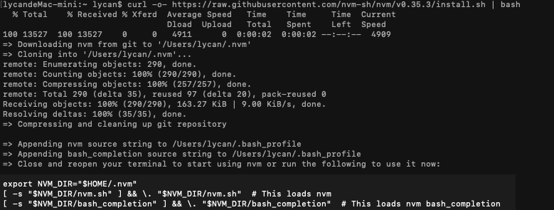
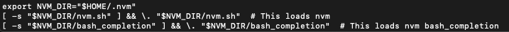
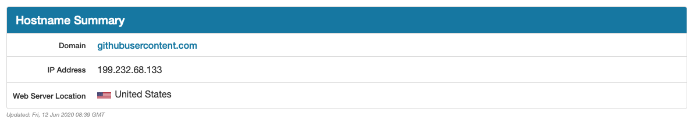
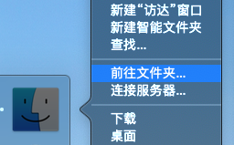
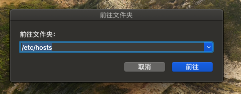
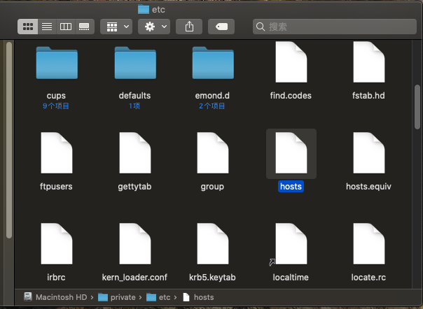
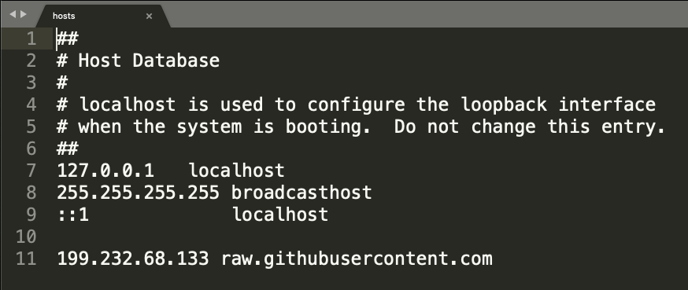
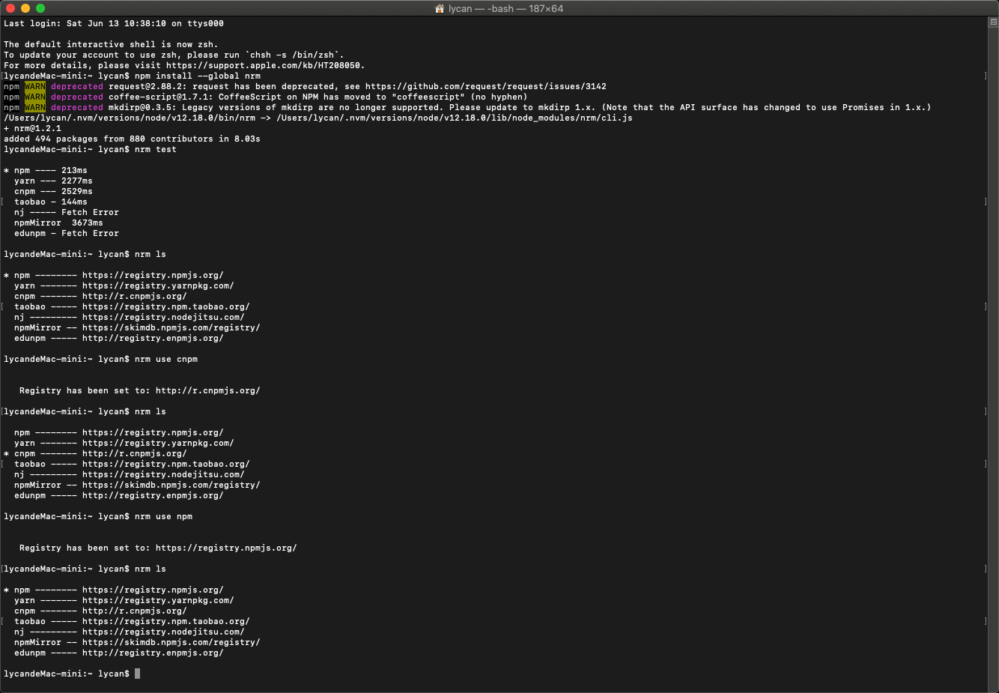

# Node.js安装


## nvm

### 1. 安装nvm 

在安装Node.js之前，需要安装nvm，然后通过nvm命令安装并管理Node.js。
```
curl -o- https://raw.githubusercontent.com/nvm-sh/nvm/v0.35.3/install.sh | bash
```
显示结果：


关闭并重新打开终端或直接运行显示结果中最后代码：


打印版本号验证安装成功
```
nvm --version
```

> **注意:** 
> 
> 1. 安装nvm前卸载已有Node.js
> ```
> sudo npm uninstall npm -g
> sudo rm -rf /usr/local/lib/node /usr/local/lib/node_modules /var/db/receipts/org.nodejs.*
> sudo rm -rf /usr/local/include/node /Users/$USER/.npm
> sudo rm /usr/local/bin/node
> sudo rm /usr/local/share/man/man1/node.1
> sudo rm /usr/local/lib/dtrace/node.d
> ```
> 
> 2. curl: (7) Failed to connect to raw.githubusercontent.com port 443: Connection refused 安装失败解决方案
> * 打开网站 [https://www.ipaddress.com/](https://www.ipaddress.com/)，查询一下 raw.githubusercontent.com对应的IP 地址
> 
>   
> 
> * 替换系统的host文件，写上：199.232.68.133 raw.githubusercontent.com
> 
>   
>   
>   
>   

### 2. 安装Node.js

```
// 安装指定版本 Node.js
nvm install 12.18.0
// 确定安装位置
which node
// 指定默认版本
nvm alias default node
// 确认版本
node -v
```

### 3. 安装nrm
nrm用于快速切换不同npm，它默认内置了很多常用的源。

全局安装nrm
```
npm install --global nrm 
```
测速
```
nrm test
```
查看源
```
nrm ls
```
切换源
```
nrm use cnpm
```
增加源
```
nrm add npmname npmurl
```
